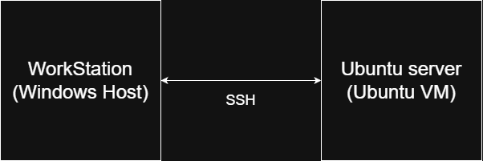

# Week 1 – System Planning and Distribution Selection

## Overview
This week focuses on planning the operating system deployment, selecting an appropriate Linux
server distribution, and documenting the system architecture and network configuration.

## System Architecture
The system follows a dual-system architecture. A Windows workstation is used as the
administrative client, while a headless Ubuntu Server virtual machine runs the server
operating system. All server administration is performed remotely via SSH.

## Distribution Selection
Ubuntu Server was selected as the server operating system for this coursework.
It is a stable, widely used Linux server distribution with long-term support (LTS),
making it suitable for secure and reliable server deployments.

Compared to alternatives such as CentOS or Debian, Ubuntu Server provides more
up-to-date packages while maintaining stability. It also has extensive documentation
and community support, which is beneficial when configuring security controls,
remote access, and performance monitoring.

The availability of regular security updates and strong support for tools such as
SSH, firewalls, fail2ban, and AppArmor makes Ubuntu Server an appropriate choice
for this operating systems coursework.

## Workstation Choice
A Windows host machine was selected as the workstation system for this coursework.
The workstation is used to remotely administer the Linux server via SSH, providing
a clear separation between the client and server environments.

Using the Windows host as the workstation avoids unnecessary additional virtual
machines while still meeting the coursework requirement for remote administration.
SSH client tools are readily available on Windows, enabling secure command-line
access to the server for configuration, monitoring, and testing tasks.

This approach reflects real-world administration practices where servers are often
managed remotely from a separate client system.

## Network Configuration
The server and workstation systems will communicate using a VirtualBox virtual
network configuration. A host-only or NAT-based network will be used to allow
secure communication between the Windows workstation and the Ubuntu Server
virtual machine while keeping the environment isolated from external networks.

The Ubuntu Server will be assigned an internal IP address by the virtual network,
and all administrative access will be performed remotely via SSH from the
workstation. This configuration supports secure remote management and allows
firewall rules to be applied later in the coursework to restrict access to the server.

This planned network setup ensures controlled connectivity, security isolation,
and compliance with the coursework requirement for remote administration.

## System Specifications (CLI Evidence)
System specifications will be collected once the Ubuntu Server virtual machine
is deployed. Command-line tools such as `uname`, `free`, `df -h`, `ip addr`, and
`lsb_release` will be used to document kernel version, memory usage, disk
allocation, network configuration, and operating system details.

All commands will be executed remotely via SSH from the workstation to ensure
compliance with the coursework requirement for command-line-based system
administration.

## Reflection
(To be added)
